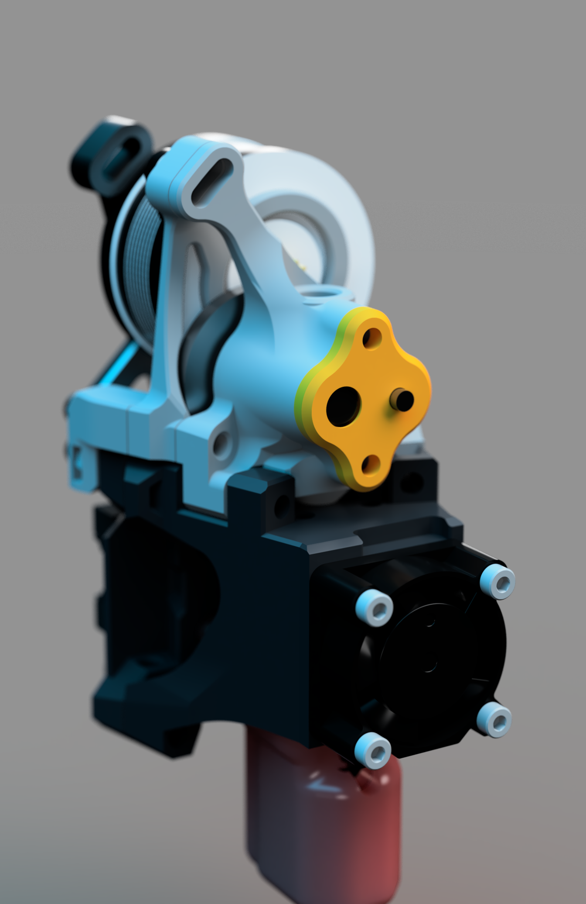
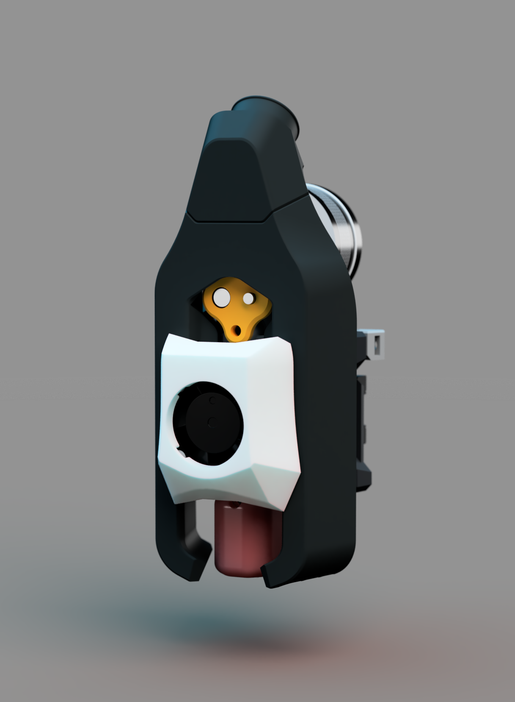
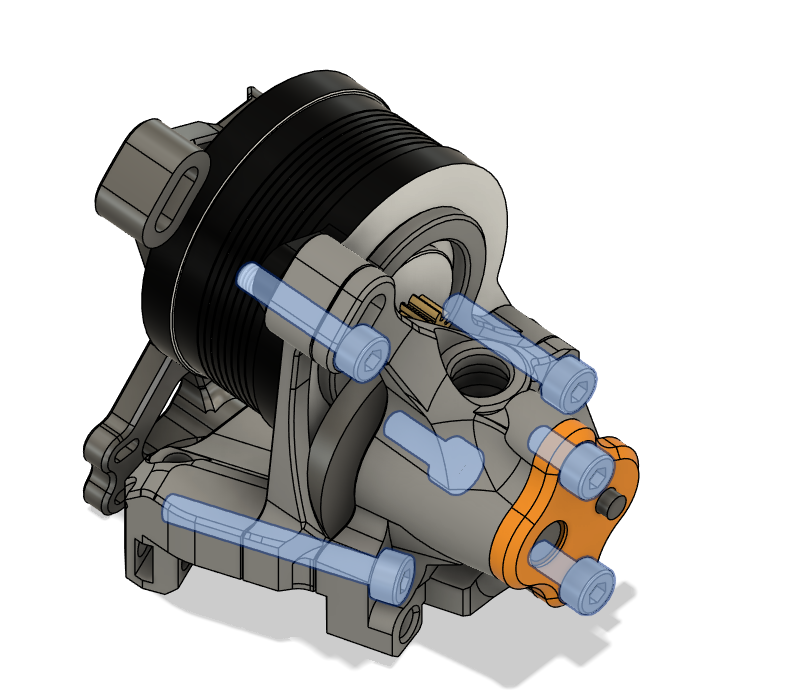

# Shepherd
This is an integrated fixed gear extruder for the Archetype toolhead ecosystem, designed to be used for the Breakneck cooling solution.
Since the regular ducts inlets are too low ive moved them up a little to accomodate for the BMG gears in the flat top configuration.

BOM:
- 3 x M3x6 Screws (5mm and 8mm might also work)
- 2x M3x14 Screws (longer also works)
- 1x M3x25 Screw (longer works)
- 1x 5mm bowden collet
- 5x Voron M3 heatsets
- 3x M3 Square Nutz

For the Vertical Belt Pins the Left Pin one should be either BHCS or a 3mm Dowel
